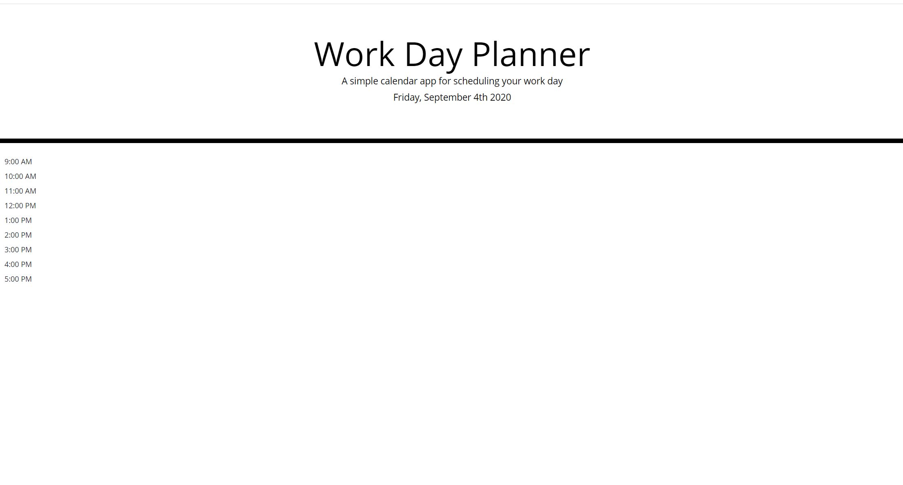
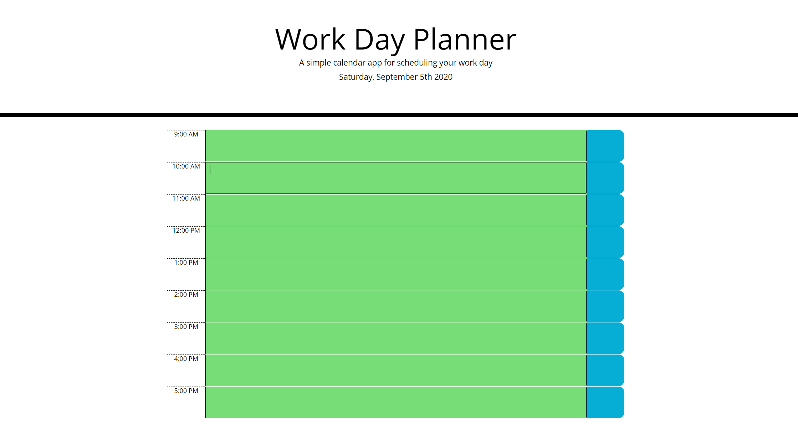
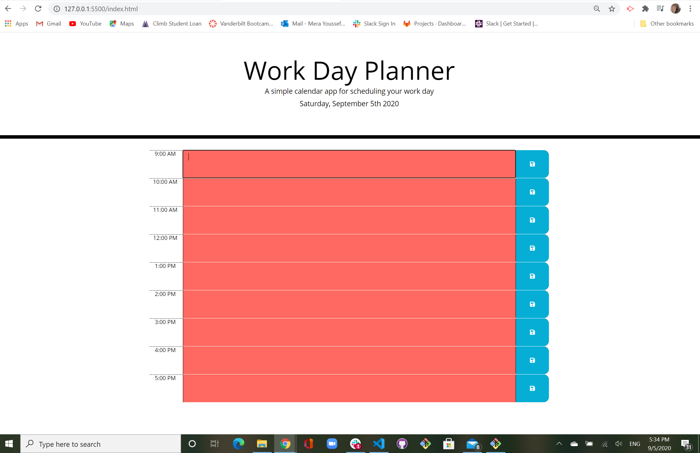
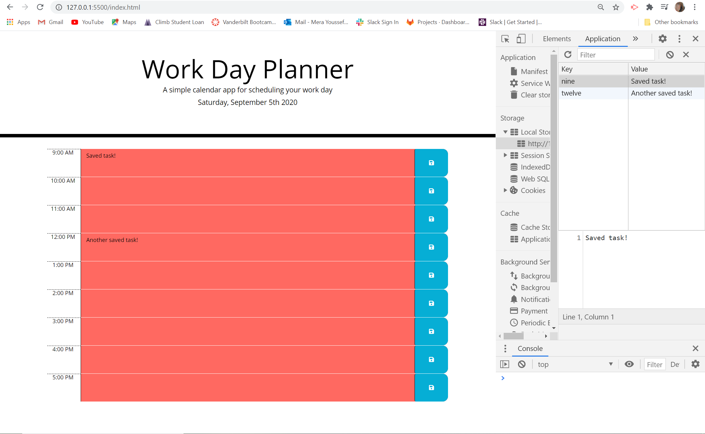

# Work Day Scheduler/ Daily Planner
The purpose of this project is to create a calendar with work day hours to which events can be added to the calendar and saved to keep track of daily tasks. The calendar will have different colors when the added task has passed and when a future task is coming up. The calendar will also be storing the tasks put in so even if the page is refreshed the tasks added will remain.

# GitHub Repo:
https://github.com/merayoussef/daily-planner.git

# GitHub Deployed Site:
 https://merayoussef.github.io/daily-planner/

# Screenshots and updates of project:

# Project Requirements:
GIVEN I am using a daily planner to create a schedule

WHEN I open the planner THEN the current day is displayed at the top of the calendar

WHEN I scroll down THEN I am presented with time blocks for standard business hours

WHEN I view the time blocks for that day THEN each time block is color-coded to indicate whether it is in the past, present, or future

WHEN I click into a time block THEN I can enter an event

WHEN I click the save button for that time block THEN the text for that event is saved in local storage

WHEN I refresh the page THEN the saved events persist
